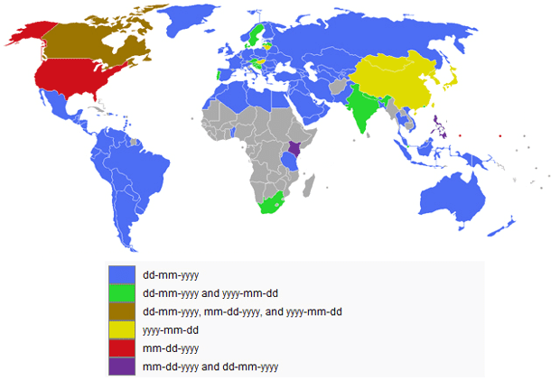

<<<<<<< HEAD

# Data science fellowship 04/22/19 


### Data science calendar

[Calendar](https://calendar.google.com/calendar/embed?src=flatironschool.com_ol6td9qn7mv33socuqn1195oqc%40group.calendar.google.com&ctz=America%2FNew_York)

### Important links 

 [student master sheet](https://docs.google.com/spreadsheets/d/1gx4sfDQXYgk5xknYquXZEzZ6qmrJXc1rtesc5BPYKG0/edit#gid=0)


### Week I 

|                 | One                                       | Two                                       | Three                                     | Four                                      | Five                                      |
|:----------------|:------------------------------------------|:------------------------------------------|:------------------------------------------|:------------------------------------------|:------------------------------------------|
| Warm-up   | <a href=""></a> | <a href="https://github.com/learn-co-students/dc_ds_04_22_19/blob/master/module_1/morning_warm_up/week_1/1_1_dictionaries.md">Dictionary</a> <br><a href="https://github.com/learn-co-students/dc_ds_04_22_19/tree/master/module_1/morning_warm_up/week_1/solutions">solution</a>  | <a href="https://github.com/learn-co-students/dc_ds_04_22_19/blob/master/module_1/morning_warm_up/week_1/1_2_for_loops.md">For loops</a> <br><a href="https://github.com/learn-co-students/dc_ds_04_22_19/tree/master/module_1/morning_warm_up/week_1/solutions">solution</a>| <a href="https://github.com/learn-co-students/dc_ds_04_22_19/blob/master/module_1/morning_warm_up/week_1/1_3_pandas%20and%20numpy.md">pandas & numpy</a><br><a href="https://github.com/learn-co-students/dc_ds_04_22_19/tree/master/module_1/morning_warm_up/week_1/solutions">solution</a> | <a href="https://github.com/learn-co-students/dc_ds_04_22_19/blob/master/module_1/morning_warm_up/week_1/1_4_numpy_func_tr_test_split.md">numpy *hard</a><br><a href="https://github.com/learn-co-students/dc_ds_04_22_19/tree/master/module_1/morning_warm_up/week_1/solutions">solution</a> |
| Morning code    | <a href=""></a> | <a href=""></a> | <a href="https://github.com/learn-co-students/dc_ds_04_22_19/tree/master/module_1/week_1/day_3_lecture_1_python_202_adv_loops">advanced loops</a> | <a href="https://github.com/learn-co-students/dc_ds_04_22_19/tree/master/module_1/week_1/day_4_lecture_1_manipulating_with_pandas">manipulating with pandas</a> | <a href=""></a> |
| Morning video   | <a href="">  </a> | <a href="">  </a> | <a href="https://www.youtube.com/watch?v=h03PYgc0gdk&list=PLc6AmvC5ZybwJp0o8Kv0Ks5a0idq8eiOW&index=3&t=0s"> advanced loops video </a> | <a href="https://www.youtube.com/watch?v=LU3arMXqo4Q&list=PLc6AmvC5ZybwJp0o8Kv0Ks5a0idq8eiOW&index=4&t=0s"> manipulating with pandas video </a> | <a href=""></a> |
| Afternoon code  | <a href="http://ae-flatiron.s3-website-us-east-1.amazonaws.com/slides-flatiron-terminal.html#/"> Terminal </a>   <a href="https://github.com/learn-co-students/dc_ds_04_22_19/blob/master/module_1/week_1/welcome_to_git_day_1_lec_2.pdf"> Git </a> |   <a href="https://github.com/learn-co-students/dc_ds_04_22_19/tree/master/module_1/day_2_lecture_1_python-101-assignment-to-loops">assignment to loops</a>  | <a href="https://github.com/learn-co-students/dc_ds_04_22_19/tree/master/module_1/week_1/day_3_lecture_2_numpy_n_pandas">pandas & numpy intro</a> | <a href="https://github.com/learn-co-students/dc_ds_04_22_19/tree/master/module_1/week_1/day_4_lecture_2_matplotlib">matplotlib</a> | <a href=""></a> |
| Afternoon video | <a href="">  </a> | <a href="https://www.youtube.com/watch?v=9-M5qrCMPmg&list=PLc6AmvC5ZybwJp0o8Kv0Ks5a0idq8eiOW&index=2&t=0s"> assignment to loops video </a> | <a href=""> TBD </a> | <a href="https://www.youtube.com/watch?v=dhtd7h5XFxY&list=PLc6AmvC5ZybwJp0o8Kv0Ks5a0idq8eiOW&index=5&t=0s"> matplotlib video  </a> | <a href=""> </a> |


### Week II 

|                 | Six                                       | Seven                                       | Eight                                     | Nine                                      | Ten                                      |
|:----------------|:------------------------------------------|:------------------------------------------|:------------------------------------------|:------------------------------------------|:------------------------------------------|
| Warm-up    | <a href="https://github.com/learn-co-students/dc_ds_04_22_19/blob/master/module_1/morning_warm_up/week_2/2_1_visualization_matplotlib.md">matplotlib</a> <br><a href="https://github.com/learn-co-students/dc_ds_04_22_19/tree/master/module_1/morning_warm_up/week_2/solutions">solution</a>  | <a href="https://github.com/learn-co-students/dc_ds_04_22_19/blob/master/module_1/morning_warm_up/week_2/2_2_apply_lambda_gb_plt.md">apply, lambda & groupby</a> <br><a href="https://github.com/learn-co-students/dc_ds_04_22_19/tree/master/module_1/morning_warm_up/week_2/solutions">solution</a>| <a href="https://github.com/learn-co-students/dc_ds_04_22_19/blob/master/module_1/morning_warm_up/week_2/2_3_simulation_np_random_n_dict.md">dict + numpy random</a><br><a href="https://github.com/learn-co-students/dc_ds_04_22_19/tree/master/module_1/morning_warm_up/week_2/solutions">solution</a> | <a href="https://github.com/learn-co-students/dc_ds_04_22_19/blob/master/module_1/morning_warm_up/week_2/2_4_histogram_lr_creation.md">Linear regression</a><br><a href="https://github.com/learn-co-students/dc_ds_04_22_19/tree/master/module_1/morning_warm_up/week_2/solutions">solution</a> |
| Morning code    | <a href="https://github.com/learn-co-students/dc_ds_04_22_19/tree/master/module_1/week_2/day_6_lecture_1_pandas_3">Tidy data</a> | <a href="https://github.com/learn-co-students/dc_ds_04_22_19/tree/master/module_1/week_2/day_7_lecture_1_good_vis_seaborn">seaborn</a> | <a href="https://github.com/learn-co-students/dc_ds_04_22_19/tree/master/module_1/week_2/day_8_multiple_linear_regression">Multiple linear regression</a> | <a href="https://github.com/learn-co-students/dc_ds_04_22_19/tree/master/module_1/week_2/day_9_cross_validation">Cross - validation</a> | <a href=""></a> |
| Morning video   | <a href="">  </a> | <a href="https://www.youtube.com/watch?v=2WOMr1-wdyQ&list=PLc6AmvC5ZybwJp0o8Kv0Ks5a0idq8eiOW&index=8&t=0s"> seaborn video </a> | <a href="https://www.youtube.com/watch?v=EMEXCz3bcdQ&list=PLc6AmvC5ZybwJp0o8Kv0Ks5a0idq8eiOW&index=9&t=0s"> multiple linear regression video </a> | <a href="">  </a> | <a href=""></a> |
| Afternoon code  | <a href="https://github.com/learn-co-students/dc_ds_04_22_19/tree/master/module_1/week_2/day_6_lecture_2_code_best_practices"> Coding best practices </a>  | <a href="https://github.com/learn-co-students/dc_ds_04_22_19/tree/master/module_1/week_2/day_7_lecture_2_linear_regression"> Linear regression </a> |   <a href="https://github.com/learn-co-students/dc_ds_04_22_19/tree/master/module_1/week_2/day_8_feature_scaling">Feature scaling & manipulation</a>  | <a href="https://github.com/learn-co-students/dc_ds_04_22_19/tree/master/module_1/week_2/day_9_quality_deliverables">Quality deliverables</a> | <a href=""></a> | <a href=""></a> |
| Afternoon video | <a href="https://www.youtube.com/watch?v=ZAnxVtVAvgE&list=PLc6AmvC5ZybwJp0o8Kv0Ks5a0idq8eiOW&index=6">Best practice video  </a> | <a href="https://www.youtube.com/watch?v=wAIprkeCllY&list=PLc6AmvC5ZybwJp0o8Kv0Ks5a0idq8eiOW&index=10&t=0s"> linear regression video </a> | <a href="">  </a> | <a href="https://youtu.be/Y8QP-x33u2U"> Quality deliverables video </a> | <a href="">  </a> |


### Week IV

|                 | Eleven                                       | Twelve                                       | thirteen                                     | Fourteen                                      | Fifteen                                      |
|:----------------|:------------------------------------------|:------------------------------------------|:------------------------------------------|:------------------------------------------|:------------------------------------------|
| Warm-up    | <a href=""></a> <br><a href=""> </a>  | <a href="https://github.com/learn-co-students/dc_ds_04_22_19/blob/master/module_2/morning%20warm-up/week_1/4_1_matrix_multi_multi_reg.md">Matrix multiplication+ regression</a> <br><a href="">solution</a>| <a href="https://github.com/learn-co-students/dc_ds_04_22_19/blob/master/module_2/morning%20warm-up/week_1/4_2_sql_joins.md">SQL joins</a><br><a href="">solution</a> | <a href=""></a><br><a href="">solution</a> |
| Morning code    | <a href="https://github.com/learn-co-students/dc_ds_04_22_19/tree/master/module_2/week_1/day_16_lecture_1_sql">Sql</a> | <a href=""></a> | <a href="https://github.com/learn-co-students/dc_ds_04_22_19/tree/master/module_2/week_1/day_18_lecture_1_json"> JSON</a> | <a href=""></a> | <a href=""></a> |
| Morning video   | <a href="">  </a> | <a href="">  </a> | <a href="">  </a> | <a href="">  </a> | <a href=""></a> |
| Afternoon code  | <a href=""> </a>  | <a href="https://github.com/learn-co-students/dc_ds_04_22_19/tree/master/module_2/week_1/day_17_lecture_1_oop"> OOP</a> |   <a href=""></a>  | <a href=""></a> | <a href=""></a> | <a href=""></a> |
| Afternoon video | <a href="">  </a> | <a href=""></a> | <a href="">  </a> | <a href="">  </a> | <a href="">  </a> |


=======
# Lambda Functions - Lab

## Introduction

In this lab, you'll get some hands on practice creating and using lambda functions.

## Objectives
You will be able to:
* Understand what lambda functions are and why they are useful
* Use lambda functions to transform data within lists and DataFrames

## Lambda Functions


```python
import pandas as pd
df = pd.read_csv('Yelp_Reviews.csv')
df.head(2)
```


<div>
<style>
    .dataframe thead tr:only-child th {
        text-align: right;
    }

    .dataframe thead th {
        text-align: left;
    }

    .dataframe tbody tr th {
        vertical-align: top;
    }
</style>
<table border="1" class="dataframe">
  <thead>
    <tr style="text-align: right;">
      <th></th>
      <th>Unnamed: 0</th>
      <th>business_id</th>
      <th>cool</th>
      <th>date</th>
      <th>funny</th>
      <th>review_id</th>
      <th>stars</th>
      <th>text</th>
      <th>useful</th>
      <th>user_id</th>
    </tr>
  </thead>
  <tbody>
    <tr>
      <th>0</th>
      <td>1</td>
      <td>pomGBqfbxcqPv14c3XH-ZQ</td>
      <td>0</td>
      <td>2012-11-13</td>
      <td>0</td>
      <td>dDl8zu1vWPdKGihJrwQbpw</td>
      <td>5</td>
      <td>I love this place! My fiance And I go here atl...</td>
      <td>0</td>
      <td>msQe1u7Z_XuqjGoqhB0J5g</td>
    </tr>
    <tr>
      <th>1</th>
      <td>2</td>
      <td>jtQARsP6P-LbkyjbO1qNGg</td>
      <td>1</td>
      <td>2014-10-23</td>
      <td>1</td>
      <td>LZp4UX5zK3e-c5ZGSeo3kA</td>
      <td>1</td>
      <td>Terrible. Dry corn bread. Rib tips were all fa...</td>
      <td>3</td>
      <td>msQe1u7Z_XuqjGoqhB0J5g</td>
    </tr>
  </tbody>
</table>
</div>


## Simple Arithmetic

Use a lambda function to create a new column called 'stars_squared' by squarring the stars column.


```python
#Your code here
```

## Dates
Select the month from the date string using a lambda function.


```python
# Your code here
```

## What is the average number of words for a yelp review?
Do this with a single line of code!


```python
# Your code here
```

## Create a new column for the number of words in the review.


```python
#Your code here
```

## Rewrite the following as a lambda function. Create a new column 'Review_Length'


```python
def rewrite_as_lambda(value):
    if len(value) < 50:
        return 'Short'
    elif len(value) < 80:
        return 'Medium'
    else:
        return 'Long'
#Hint: nest your if, else conditionals
```


```python
#Your code here
```

## Level Up: Dates Advanced!
  

Overwrite the date column by reordering the month and day from YYYY-MM-DD to DD-MM-YYYY. Try to do this using a lambda function.


```python
#Your code here
```

## Summary

Great! Hopefully you're getting the hang of lambda functions now! It's important not to overuse them - it will often make more sense to define a function so that it's reusable elsewhere. But whenever you need to quickly apply some simple processing to a collection of data you have a new technique that will help you to do just that. It'll also be useful if you're reading someone else's code that happens to use lambdas.
>>>>>>> dd64f9ef7aac15b6564e8eda5622c1bb5254c85b
